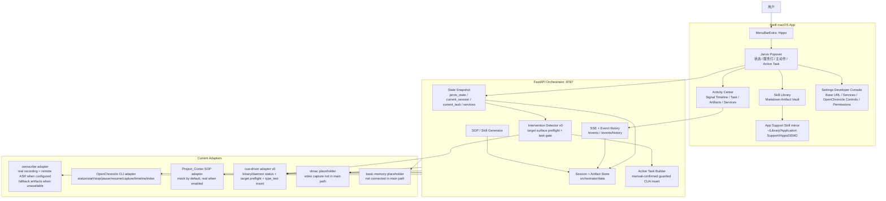

# HippoDEMO PRD Realtime Path

> 当前实现对齐版  
> 更新时间：2026-05-13  
> 本文档描述当前 HippoDEMO 真实软件效果，不把目标态能力写成已完成能力。

## 1. 当前产品定位

HippoDEMO 当前是一个常驻 macOS 状态栏的本地 Jarvis 原型。它由 SwiftUI 状态栏应用和本地 FastAPI Orchestrator 组成，主路径围绕一次会议/录音 session 展开：

1. 用户从状态栏 Popover 点击 `Jarvis ON`。
2. Orchestrator 创建本地 Demo Session，并协调 OpenChronicle 与 ownscribe。
3. 用户可以在录制中点击 `Capture Skill` / `Finish Capture`，手动框定一段 SOP。
4. 用户点击 `Jarvis OFF` 后，系统停止/封存采集，生成或回退生成会议产物。
5. Orchestrator 生成一个 Active Task 候选。
6. Orchestrator 运行 Intervention Detector v0，检查当前 target surface 是否可安全插入。
7. 用户在 Popover 或 Activity Center 中确认、忽略或完成任务。
8. 用户可以生成 Skill，并在 Skill Library 中查看 Markdown 产物。

当前软件已经是可运行的 macOS 状态栏应用，而不是 Web Dashboard。它的真实交互面包括：

- `MenuBarExtra` 状态栏入口和短 Popover。
- `Activity Center` 活动中心窗口。
- `Skill Library` 技能产物库窗口。
- macOS `Settings` 形式的 Developer Console。

当前仍是 demo / prototype，不是完整自动代理产品。尤其是：自动介入 HUD、微信/邮箱等目标 App 专用插入、vlmac 视频链路、basic-memory 持久知识链路还没有进入真实主路径。cua-driver 已进入最小真实执行层，并增加了 target surface preflight；默认只放行 TextEdit、CotEditor、Notes 这类低风险可编辑目标，且必须用户确认后才插入。

## 2. 当前产品原则

- 默认常驻状态栏，主界面是短 Popover，完整窗口只在回看、调试、查看 Skill 时打开。
- 用户手动控制 demo 主路径：`Jarvis ON`、`Capture Skill`、`Finish Capture`、`Jarvis OFF`、`Insert`、`Complete`。
- 外部可见动作不自动执行。当前版本只有 target surface preflight 放行且用户点击 `Insert` 后才会调用 cua-driver；成功后进入 `task_reviewing`，失败时保留任务候选并记录 `cua_insert_failed`。
- Active Task 是主抽象，邮件、微信、CRM、文档只是未来可接入的 target surface 示例。
- ownscribe / OpenChronicle 走 adapter-first 路线：能接真实服务就接，失败时保留 mock fallback，保证 demo 流不被阻断。
- Settings / Developer Console 用于服务状态、OpenChronicle 控制和运行时配置，不是主产品路径。
- Project_Cortex 前端不进入主路径；其 SOP 生成能力通过 Orchestrator adapter 保留，默认 mock，配置后可调用真实后端。

## 3. 当前真实软件拓扑



早期静态拓扑图仍保留在 [hippo_demo_topology.jpg](/Users/massif/Desktop/HippoDEMO/hippo_demo_topology.jpg)，但当前以本文档为真实实现口径。

## 4. 当前用户路径

### 4.1 App 启动

用户启动 `HippoJarvis.app` 后，应用以状态栏 `Hippo` 入口运行。Swift 侧会：

- 默认连接 `http://127.0.0.1:8787`。
- 如果 Orchestrator 未运行，通过 `OrchestratorLauncher` 用 Swift `Process` 启动 `uvicorn orchestrator.main:app`。
- 将 Orchestrator 日志写入 `.runtime/orchestrator-app.log`，pid 写入 `.runtime/orchestrator-app.pid`。
- 拉取 `/state`，并开始监听 `/events` SSE。

可见效果：

- 状态栏显示 `Hippo` 和状态图标。
- Popover 顶部显示 `HIPPO`、状态胶囊、状态标题、状态说明。
- 如果 Orchestrator 不可用，Popover 显示错误条。

### 4.2 Jarvis ON

用户点击 Popover 中的 `Jarvis ON` 后，Swift 调用：

```text
POST /session/jarvis-on
```

Orchestrator 当前真实行为：

- 创建一个 `DemoSession`。
- 将状态设为 `meeting_active`。
- 调用 OpenChronicle adapter 的 `start`。
- 调用 ownscribe adapter 的 `start` / `start_recording`。
- 发布 `session_started` 和 ownscribe 启动相关事件。
- 刷新 service matrix。

ownscribe 启动成功时，服务状态会进入 `recording`。如果 ownscribe 不可用、依赖缺失或进程快速退出，主路径不会中断；服务状态会进入 `error` 或 `unavailable`，并在后续 `Jarvis OFF` 时使用 fallback artifacts。

### 4.3 Capture Skill / Finish Capture

录制状态下，Popover 显示 `Capture Skill`。点击后调用：

```text
POST /sop/capture-start
```

当前行为：

- 记录 `check_in`。
- 状态映射为 `sop_marking`。
- Popover 主操作切换为 `Finish Capture`。
- 发布 `sop_capture_started`。

点击 `Finish Capture` 后调用：

```text
POST /sop/capture-finish
```

当前行为：

- 记录 `check_out`。
- 状态映射为 `sop_generating`。
- 调用 Project_Cortex SOP adapter。
- 默认生成 mock `Investor Follow-up Skill` 风格 Markdown。
- 保存到 `orchestrator/data/skills/*.md` 和 `orchestrator/data/skills.json`。
- Swift 侧把技能镜像写入 `~/Library/Application Support/HippoDEMO/Skills` 和 `skills.json`。
- 失败时保留错误 detail，并通过 Swift 错误条展示 FastAPI `detail`。

真实 Project_Cortex 后端仅在以下环境变量启用后调用：

```text
HIPPO_USE_PROJECT_CORTEX=true
PROJECT_CORTEX_URL=http://127.0.0.1:8000
```

### 4.4 Jarvis OFF

用户点击 `Jarvis OFF` 后，Swift 调用：

```text
POST /session/jarvis-off
```

Orchestrator 当前真实行为：

- 调用 OpenChronicle `capture-once`；如果失败，保守尝试 `timeline tick`。
- 停止 ownscribe recording。
- ownscribe stop 默认受 `HIPPODEMO_OWNSCRIBE_STOP_TIMEOUT_SECONDS=45` 控制，超时后快速 terminate/kill。
- 如果 ownscribe 产出 transcript / summary / audio artifact，则写入 session。
- 如果没有可用 ownscribe artifact，则生成 mock meeting artifacts。
- 生成 Active Task。
- 将状态设为 `active_task_candidate`。
- 发布 `artifact_ready`、`active_task_generated`、`session_stopped` 等事件。

当前可能出现两种效果：

- 真实录音/ASR配置可用：产生 `meeting_transcript`、`meeting_minutes` 或 `audio_recording` 等 artifact。
- ownscribe 不可用或 ASR失败：产生 mock `meeting_minutes`、`follow_up_body`、`action_items`，并在 service detail 中说明 fallback。

### 4.5 Active Task

当前 Active Task 由 Orchestrator 的 `build_active_task()` 生成，标题为类似：

```text
Insert investor follow-up draft
```

包含的动作包括：

- `Insert follow-up body`
- `Attach action items`

用户可在 Popover 或 Activity Center 中执行：

```text
POST /active-task/{task_id}/confirm
POST /active-task/{task_id}/ignore
POST /active-task/{task_id}/complete
```

当前真实限制：

- `confirm` 会调用 cua-driver adapter 的最小 `type_text` 路径，只处理 `insert_draft` action。
- 默认要求 `cua-driver serve` daemon 已运行；如果只有 binary 没有 daemon，服务灯显示 `available`，插入会失败并提示启动 daemon。
- `GET /integrations/cua/target-surface` 会做 target surface preflight，返回是否 safe、目标 app/window、AX editable element 和拦截原因。
- 默认只放行 TextEdit、CotEditor、Notes 的 editable document / note surface；其他 app 需要显式加入 `HIPPODEMO_CUA_SAFE_BUNDLE_IDS` 或打开受控实验开关。
- 微信、邮件、浏览器、Terminal / iTerm / Ghostty、Codex / ChatGPT 等高风险或外部可见目标默认拒绝。
- `POST /intervention/detect` 是 Intervention Detector v0：基于当前 Active Task 和 target surface preflight 发布 `intervention_signal_detected` 或 `intervention_signal_waiting`。
- 成功后 proposed action 状态标记为 `inserted`；失败时标记为 `insert_failed`，并发布 `cua_insert_failed`。
- `complete` 会把状态切到 `pattern_detected`，让用户可以继续生成 Skill。

### 4.6 Skill Library

Skill Library 当前是本地 Markdown artifact vault：

- Sidebar 显示技能名称、描述、来源、日期和短 ID。
- Detail 显示来源、创建时间、大小、生成方式。
- Markdown 预览是只读 `Text`，不是完整 Markdown renderer。
- 支持删除 Skill；删除会移除 Orchestrator 里的记录和 Markdown 产物，Swift 侧随后同步镜像。
- 支持搜索名称、描述和内容。

当前未实现：

- 重命名。
- `@Skill` 引用。
- 真实流程复用执行。
- 打开源 Session 证据详情。

## 5. 当前 Swift 前端职责

### 5.1 MenuBarExtra / Popover

已实现：

- `MenuBarExtra("Hippo")` 状态栏入口。
- Jarvis 状态核、状态胶囊、状态标题和短说明。
- OpenChronicle、ownscribe、cua-driver、vlmac 四个优先服务灯。
- 当前最重要主动作：`Jarvis ON`、`Jarvis OFF`、`Finish Capture`、`Insert`、`Generate Skill`。
- `Capture Skill` 作为独立动作，和 `Jarvis ON/OFF` 不合并。
- Active Task 卡片、置信度、目标 surface、插入/忽略按钮。
- Activity、Skills、Settings、Refresh、Language、Quit 图标入口。
- 中英文基础文案切换。

未实现：

- 独立的全局 Intervention HUD 浮层。
- 根据当前 App 自动弹出主动介入提示。
- 微信、邮件、浏览器等专用 target surface 识别和插入。

当前“介入”体现在 Popover / Activity Center 中显示 Active Task，并通过 target surface preflight 决定 `Insert` 是否可用；还没有做独立浮层或自动弹窗。

### 5.2 Activity Center

已实现：

- `NavigationSplitView` 活动中心。
- Sidebar 展示 current、signal、task。
- 主区域展示 Signal Timeline。
- 右侧展示当前 signal、task、artifacts、service health。
- 从 `/events/history?limit=80` 拉取事件历史。
- 没有事件时使用当前 snapshot 派生 `Current Signal`，避免空白页。
- 支持对当前任务执行 insert/complete/ignore。

未实现：

- 多历史任务完整列表。
- transcript / meeting minutes 全文展开审阅。
- 撤销、重新生成、重新插入。
- Session 证据包浏览器。

### 5.3 Settings / Developer Console

已实现：

- Orchestrator Base URL 配置。
- Runtime 概览：base URL、状态、服务数量。
- Service Matrix：展示所有 services 的状态和 detail。
- OpenChronicle 控制：
  - Start
  - Stop
  - Pause
  - Resume
  - Capture Once
  - Timeline Tick
  - Rebuild Captures Index
- 权限提示：麦克风、屏幕录制、辅助功能。
- 语言切换。

未实现：

- ownscribe 服务地址/ASR 配置 UI。
- Dify API 配置 UI。
- cua-driver 连接配置 UI。
- vlmac 视频预览。
- basic-memory 搜索和 note preview。
- trajectory viewer 或 ai-manus/VNC 入口。

## 6. 当前 Orchestrator API

当前 FastAPI 服务运行在 `127.0.0.1:8787`，核心 API 为：

```text
GET  /health
GET  /state
GET  /events
GET  /events/history?limit=50

POST /session/jarvis-on
POST /session/jarvis-off
POST /session/pause
POST /session/resume

POST /sop/capture-start
POST /sop/capture-finish

POST /active-task/generate
POST /active-task/{task_id}/confirm
POST /active-task/{task_id}/ignore
POST /active-task/{task_id}/complete

POST /skill/generate
GET  /skills
DELETE /skill/{skill_id}

POST /integrations/openchronicle/start
POST /integrations/openchronicle/stop
POST /integrations/openchronicle/pause
POST /integrations/openchronicle/resume
POST /integrations/openchronicle/capture-once
POST /integrations/openchronicle/rebuild-captures-index
POST /integrations/openchronicle/timeline-tick
```

`/state` 返回 Swift 使用的 snapshot：

```json
{
  "jarvis_state": "active_task_candidate",
  "status_message": "Ready to Act",
  "current_session": {},
  "sop_capture": {},
  "current_task": {},
  "skills": [],
  "services": []
}
```

事件总线保留最近 200 条历史，SSE queue 使用非阻塞写入；慢订阅者不会卡住状态更新。

## 7. 当前适配器真实状态

| 模块 | 当前状态 | 真实效果 |
|---|---|---|
| OpenChronicle | real adapter v1 | CLI 可用时支持状态查询、启停、暂停恢复、capture-once、timeline tick、rebuild index；模型 provider 不可用时可能在 detail 中显示 `AuthenticationError`。 |
| ownscribe | real adapter v1 + fallback | 可启动录音子进程，支持系统声、麦克风、系统声+麦克风三种音频源；stop 后可走 OpenAI-compatible ASR 和 summary；失败时生成 mock artifacts 保持主流程。 |
| Remote ASR / Summary | adapter 已实现 | 支持 OpenAI-compatible `/v1/audio/transcriptions` 和 `/v1/chat/completions`；vLLM 只是兼容 alias。 |
| Project_Cortex | 默认 mock | 默认生成 mock `SKILL.md`；设置 `HIPPO_USE_PROJECT_CORTEX=true` 后调用真实 `/api/sop_generator`。 |
| cua-driver | real adapter v0 | 可检测本地 `cua-driver` binary / daemon；`Insert` 经用户确认后调用 `type_text` 向目标 pid 输入正文；默认不做微信/邮件专用插入。 |
| vlmac | mock placeholder | 服务灯存在，视频录制/画面理解不在当前主路径。 |
| basic-memory | placeholder | 当前没有真实写入或检索。 |
| ai-manus / cua sandbox | 未接入主路径 | 只保留为未来可选后台能力。 |

## 8. Remote ASR Provider 约定

ownscribe 当前只负责录音和输出 `recording.wav`，ASR 与总结由 Orchestrator adapter 调用远端 provider。

默认协议：

- ASR：`POST /v1/audio/transcriptions`
- Summary：`POST /v1/chat/completions`
- 默认 provider：`openai-compatible`
- 兼容 alias：`vllm`

主要环境变量：

```text
HIPPODEMO_ASR_PROVIDER=openai-compatible
HIPPODEMO_ASR_BASE_URL
HIPPODEMO_ASR_MODEL
HIPPODEMO_ASR_API_KEY
HIPPODEMO_ASR_LANGUAGE
HIPPODEMO_ASR_RESPONSE_FORMAT

HIPPODEMO_SUMMARY_PROVIDER=openai-compatible
HIPPODEMO_SUMMARY_BASE_URL
HIPPODEMO_SUMMARY_MODEL
HIPPODEMO_SUMMARY_API_KEY

HIPPODEMO_OPENAI_COMPATIBLE_BASE_URL
HIPPODEMO_OPENAI_COMPATIBLE_API_KEY
HIPPODEMO_HTTP_TIMEOUT_SECONDS

HIPPODEMO_OWNSCRIBE_AUDIO_SOURCE=system
HIPPODEMO_OWNSCRIBE_MIC_DEVICE
```

继续支持 `HIPPODEMO_VLLM_*` 作为向后兼容变量。

音频源约定：

- `system`：录系统/会议软件声音，当前默认值，适合线上会议远端声音。
- `mic`：通过 helper `--mic-only` 只录系统默认麦克风或 `HIPPODEMO_OWNSCRIBE_MIC_DEVICE` 指定输入，适合线下现场会议。
- `both`：通过 helper `--mic` 同时录系统声音和麦克风，适合线上会议同时保留远端参会者与本机发言。

录音时间戳约定：

- 每次真实录音都会生成 `recording_timeline.json`。
- `recording_started_at` 是音频 offset `0.0s` 对应的真实系统时间。
- 映射公式：`wall_time = recording_started_at + audio_offset_seconds`。
- 文件同时记录 `recording_stop_requested_at`、`recording_stopped_at`、epoch 秒、monotonic 秒、音频时长和音频源。
- Orchestrator 会把该文件 ingest 为 `recording_timeline` artifact，供 Activity Center 或后续 transcript segment 对齐使用。

ownscribe 控制接口：

```text
GET  /integrations/ownscribe/config
POST /integrations/ownscribe/config
GET  /integrations/ownscribe/audio-devices
GET  /integrations/ownscribe/preflight?network=false
```

- `config` 保存到 `orchestrator/data/ownscribe_config.json`，只存非密配置：音频源、麦克风设备、是否启用 display capture。
- API 不返回 ASR/Summary API key，只返回 provider、base URL、model 等非密信息。
- `preflight` 默认只做本地检查；只有显式 `network=true` 才探测 `/v1/models`。
- Settings Developer Console 提供 `system / mic / both` 切换、麦克风设备选择和 preflight 结果。
- Activity Center 对 `recording_timeline` artifact 做结构化展示，不只显示普通 artifact badge。

cua-driver 控制接口：

```text
GET  /integrations/cua/status
GET  /integrations/cua/target-surface
POST /integrations/cua/start
POST /integrations/cua/stop
POST /integrations/cua/restart
POST /intervention/detect
POST /active-task/{task_id}/confirm
```

- `/integrations/cua/status` 检查本地 `cua-driver` binary 和 daemon 状态。
- `/integrations/cua/target-surface` 做只读 target preflight，不插入文本。
- `/integrations/cua/start|stop|restart` 管理本地 `CuaDriver.app` daemon；有 app bundle 时优先通过 LaunchServices 启动，让 macOS TCC 权限归属到 `com.trycua.driver`。
- `/intervention/detect` 把 Active Task 和 target preflight 合并为 `intervention_signal_detected` / `intervention_signal_waiting`。
- `confirm` 不再是纯 mock；会解析 Active Task 的 `insert_draft` action，取对应 artifact 内容，先通过 target preflight，再调用 `cua-driver type_text`。
- `confirm` 优先使用 Active Task action 中已经锁定的 safe target surface；这避免用户点击确认或控制台请求时当前 active app 瞬间切走，导致插入目标被错误重算。没有有效 safe surface hint 时才重新检测当前 active app。
- 事件历史新增 `intervention_signal_detected`、`intervention_signal_waiting`、`cua_driver_command`、`cua_insert_requested`、`cua_insert_completed`、`cua_insert_failed`。
- 插入事件 payload 只记录 task/action、目标 app/pid、字符数和结果 detail，不记录正文内容。
- 默认不直接用 uvicorn 进程发键盘事件；Orchestrator 启动 daemon 时优先走 `CuaDriver.app`，让 macOS TCC 权限归属到 driver。

ASR response parser 兼容：

- `text`
- `transcript`
- `result.text`
- `result.transcript`
- `segments[].text`
- `segments[].sentence`

音频上传前，如果系统存在 `afconvert`，会尽量转为 16kHz mono Int16 WAV，降低请求体积。

## 9. 数据与文件位置

Orchestrator 数据：

```text
orchestrator/data/state.json
orchestrator/data/sessions/*.json
orchestrator/data/active_tasks/*.json
orchestrator/data/artifacts/*.md
orchestrator/data/skills.json
orchestrator/data/skills/*.md
orchestrator/data/ownscribe/<session_id>/*
```

Swift app mirror：

```text
~/Library/Application Support/HippoDEMO/skills.json
~/Library/Application Support/HippoDEMO/Skills/*.md
```

运行日志：

```text
.runtime/orchestrator-app.log
.runtime/orchestrator-app.pid
.runtime/orchestrator-launcher.log
```

OpenChronicle 外部数据仍由 OpenChronicle 自己管理，常见位置为：

```text
~/.openchronicle/*
```

## 10. 当前 MVP 范围

当前已落地：

1. App 默认常驻状态栏。
2. 状态栏 Popover 手动 `Jarvis ON` / `Jarvis OFF`。
3. Swift 自动拉起本地 Orchestrator。
4. Orchestrator 维护 session、state、events、artifacts、skills。
5. OpenChronicle real adapter v1。
6. ownscribe recording / remote ASR adapter v1，并保留 fallback。
7. `Capture Skill` / `Finish Capture` 手动 SOP 标记。
8. Project_Cortex SOP adapter，默认 mock。
9. Active Task 候选生成。
10. Confirm / Ignore / Complete 状态流。
11. Activity Center Signal Timeline。
12. Skill Library Markdown artifact vault。
13. Settings Developer Console 和 OpenChronicle 控制。
14. Intervention Detector v0 和 cua-driver target surface preflight。

当前未落地：

1. 自动判断会议开始/结束。
2. 自动识别当前微信、邮件、文档、CRM 或浏览器表单。
3. 独立 Liquid Glass Intervention HUD。
4. 微信/邮件/文档等 target surface 的专用识别与插入。
5. 自动发送、提交或发布。
6. vlmac 视频链路。
7. basic-memory 长期知识写入/检索。
8. OpenChronicle writer/reducer/classifier 的稳定模型配置。
9. 多用户云同步。

## 11. 当前风险与限制

| 风险 / 限制 | 当前真实情况 | 处理口径 |
|---|---|---|
| ownscribe runtime | 已有 adapter，但本机环境和权限会影响真实录音；失败会 fallback | UI 必须展示 service detail，不宣称每台机器都能直接实录。 |
| ASR provider | 依赖 OpenAI-compatible ASR endpoint、model 和 key | PRD 只写协议，不写具体私钥或临时验证 key。 |
| OpenChronicle 模型配置 | daemon/capture 可用不等于 writer/reducer/classifier 全部可用 | `AuthenticationError` 作为 detail 暴露，不能误报为完整长期记忆已跑通。 |
| Active Task 执行 | 当前 confirm 已接 cua-driver v0，且有 target surface preflight；默认只放行 TextEdit / CotEditor / Notes 这类低风险目标 | 不得宣称已能自动插入微信/邮件/文档；必须先确认 daemon、权限和目标 surface。 |
| Skill 生成 | 默认 Project_Cortex mock | 只有启用真实后端后才算 Dify SOP 生成。 |
| Settings 权限 | 当前只是说明性提示 | 不会自动打开系统权限页或完成授权。 |
| 非 git 根目录 | 当前目录不是 git repo | 文档修改按文件系统直接完成，不依赖 git diff。 |

## 12. 后续目标态

后续可以继续推进的真实产品路径：

1. 扩展 target surface 识别：更多低风险编辑器 -> 邮件草稿 -> 微信输入框，逐级开放。
2. 做独立轻量 HUD，但只在 Gate 放行后出现。
3. 把 Activity Center 从当前 signal timeline 扩展成 session / artifact / task 详情回看。
4. 接入 basic-memory，把已确认的会议纪要、行动项和 Skill 元信息写成长期知识。
5. 接入 vlmac 或其他视频/屏幕理解链路，作为 evidence bundle，不阻塞主路径。
6. 将 Project_Cortex mock 生成切到真实 SOP generator，并在失败时保留可重试边界。

## 13. 当前确认决策

- 新主前端是 Swift/macOS 原生状态栏应用。
- Web 前端不作为主交互面。
- 产品中心是 Active Task，不是邮件/微信单点功能。
- `Jarvis ON/OFF` 与 `Capture Skill/Finish Capture` 语义独立。
- 当前插入不是 mock；它会经过 target surface preflight，并且只在用户确认后调用 cua-driver。
- OpenChronicle 与 ownscribe 是当前优先接实的两个 adapter。
- cua-driver 已进入最小真实执行层；vlmac、basic-memory 当前仍只作为 placeholder 或后续目标，不写成已完成能力。
- Skill 产物以本地 Markdown 和 JSON index 为准，Swift 侧额外做 App Support 镜像。
- 所有外部可见动作都必须由用户确认；当前版本只验证低风险文本插入，不自动发送、提交或发布。
