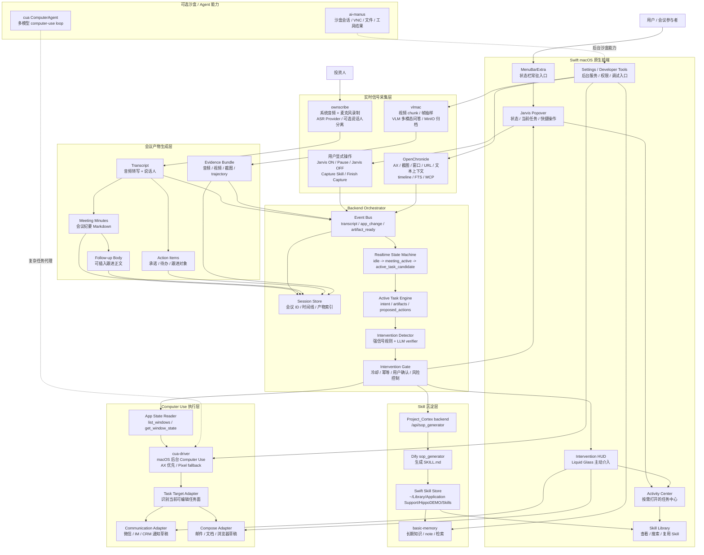

# HippoDEMO PRD Realtime Path

## 1. 背景与目标

HippoDEMO 是一个常驻 macOS 状态栏的主动任务代理。它像一个轻量 Jarvis 一样在后台理解会议、屏幕和上下文，在用户进入可行动场景时生成 `Active Task`，再通过轻量确认完成插入、通知、整理和 Skill 沉淀。

目标不是重新发明所有底层能力，而是把当前目录下已有项目组合成一个统一、低打扰、随叫随到的产品体验：

1. 进入会议室，与投资人聊天。
2. 同时开始录制音频和视频。
3. 聊天结束后，系统识别可介入时机。
4. 用户打开微信或其他沟通工具，系统识别为一个可执行的跟进 `Active Task`。
5. 用户进入邮件、文档、IM 输入框或其他可编辑工作区，系统弹出轻量确认：“我已准备好这次会议的跟进内容，是否插入到当前任务？”
6. 用户确认后，相关正文、附件或结构化内容进入当前工作区。
7. 用户审核并完成发送、提交或发布。
8. 系统识别到可复用模式，提示是否沉淀为 Skill。
9. 用户一键沉淀，并可在软件内查看生成的 Skill。

新的前端将使用 Swift / macOS 原生重新实现。默认体验不是一个长期打开的 Dashboard，而是状态栏常驻、短 Popover、主动 HUD、按需窗口。现有 Web 前端不作为主交互面使用，只保留可复用的后台能力或必要的后台设置入口。

## 2. 产品原则

- 不在会议中打断用户。会议阶段只采集、理解和准备，不主动弹窗。
- 产品中心是 `Active Task`，不是邮件、微信、会议纪要等单点功能。
- 录制和 SOP 标记是两个不同操作：录制负责采集完整上下文，SOP 标记负责人工框定可复用流程片段。
- 只有在用户进入明确可行动场景时介入，例如打开沟通窗口、写作窗口、草稿窗口或其他可编辑任务面。
- 所有外部可见动作必须人工确认，尤其是发送消息、发送内容、沉淀 Skill。
- `cua-driver` 作为主要 computer use 执行层，优先后台操作，不抢焦点。
- `Project_Cortex` 前端不使用，但保留其 SOP 生成后端能力。
- 后台设置能力可以接入，但不直接暴露在主路径。
- 默认常驻状态栏，完整窗口只在审核、配置、回看、调试时打开。
- 不展示复杂 details，除非用户主动点击查看。

## 3. 项目能力取舍

### 3.1 前端 / 交互能力

| 项目 | 采用方式 | 能力 |
|---|---|---|
| ai-manus | 可作为后台观察/沙盒页能力参考或按需窗口嵌入 | 沙盒实时 VNC 查看、一键 Take Over 接管沙盒桌面/浏览器、会话列表、流式 Chat、分享链接、文件面板、工具结果面板、PlanPanel |
| Project_Cortex | 主前端不使用 | 原有 Skill 按钮、learnedSkills、SkillsPanel 能力需要迁移到 Swift Skill Library |
| ownscribe | 无主前端 | 保留 CLI/TUI 或服务化能力，作为后台录音转写模块 |
| OpenChronicle | 后台设置/调试窗口 | 启停/暂停/状态、timeline、writer、capture-once、索引重建 |
| vlmac | 后台设置/调试窗口 | 摄像头/视频预览、VLM 对话流、事件阈值控制、定时任务管理、MinIO 文件查看、活动日志 |
| basic-memory | 后台设置/调试窗口 | 笔记搜索、近期活动、目录/知识图谱工具、MCP tool UI 搜索结果和 note preview |
| cua | 后台设置/调试窗口 | Chat + 模型选择 + sandbox 选择 + VNC Viewer、Add Sandbox 向导、本地/云/自定义 computer 接入、Trajectory Viewer 回放、Cuabot 沙盒/Agent 入口 |

### 3.2 后端 / 核心能力

| 项目 | 采用方式 | 能力 |
|---|---|---|
| ai-manus | 可复用后端能力 | 会话 CRUD、SSE 聊天、Claw WebSocket、文件/shell/browser 工具、分享、Mongo/Redis 持久化、Docker 沙盒执行、VNC WebSocket 转发与签名访问 URL |
| Project_Cortex | 只保留 SOP 生成 | `/api/sop_generator -> Dify sop_generator -> SKILL.md` |
| ownscribe | 会议音频采集与音频理解入口 | 系统音频/麦克风录制、静音检测；ASR 通过 Orchestrator provider 接入 OpenAI-compatible/vLLM/三方 API；总结通过 OpenAI-compatible LLM 接入；保留 WhisperX/pyannote 作为可选后端 |
| OpenChronicle | 上下文感知和长期活动记忆 | AX/截图采集、窗口/URL/文本上下文、timeline 聚合、session reducer、长期记忆分类、FTS 检索、只读 MCP 上下文工具 |
| vlmac | 视频理解和画面归档 | WebSocket 视频 chunk 接收、帧抽样/场景检测、VLM 多模态问答、定时视频任务、V4L2/headless capture、MinIO 归档 |
| basic-memory | 结构化长期知识 | note CRUD、Markdown/frontmatter 解析、知识图谱、全文/语义搜索、schema 校验、项目同步、MCP 工具 |
| cua | 主要执行层 | `cua-driver` macOS 后台 Computer Use、HTTP/WS/MCP computer-server、sandbox runtime、ComputerAgent 多模型循环、`/responses` agent proxy、TS Playground/AgentClient |

## 4. 整体拓扑架构

早期静态 JPG 版本已保存为 [hippo_demo_topology.jpg](/Users/massif/Desktop/HippoDEMO/hippo_demo_topology.jpg)。下面是按“状态栏 Jarvis + Active Task”方向修订后的可编辑 Mermaid 拓扑源，后续以 Mermaid 源作为实现基准。



## 5. 目标实时路径

### 5.1 阶段一：会议开始

用户进入会议软件并开始会议。Swift 前端默认停留在状态栏，用户可以从状态栏 Popover 点击 `Jarvis ON`，也可以在 Activity Center 中手动启动。

系统动作：

- 启动 ownscribe 音频录制和转写。
- 启动视频/屏幕录制链路，可使用 vlmac 或 Project_Cortex Recording 现有能力。
- 启动 OpenChronicle 上下文采集，记录当前 App、窗口、URL、可见文本和操作上下文。
- 建立一个 Demo Session，记录会议 ID、开始时间、音频流、视频流、上下文事件。

用户可见状态：

- 当前处于 `meeting_active`。
- 状态栏图标进入录制状态，可带红点、波形或进度提示。
- Popover 显示录制中、转写中、上下文采集中。
- 不主动弹窗，不给行动建议。

### 5.2 阶段二：会议进行中

系统持续收集信号，但只做后台理解。

输入信号：

- 音频转写 chunk。
- 说话人变化。
- 屏幕/会议窗口画面。
- 当前 App 与窗口变化。
- 用户是否仍在会议软件中。

后台处理：

- 更新实时 transcript。
- 生成低频会议摘要草稿。
- 标记可能的承诺、行动项、投资人关注点。
- 不触发用户打断。

状态保持：

- 默认状态为 `meeting_active`。
- 如果出现“会后发你”“我整理一下”“稍后邮件给你”“今天先这样”等语言信号，可进入 `meeting_wrapping_up`，但仍不弹窗。

### 5.2.1 SOP 手动标记

会议或任意录制会话进行中，用户可以从状态栏 Popover 点击 `Capture Skill` 按钮，手动框定一段可复用流程。

Project_Cortex 当前实现是 `HighlightButton.svelte`：

- 只在录制中显示。
- 第一次点击记录 `check_in = new Date().toISOString()`，进入 `highlighting`。
- 第二次点击记录 `check_out = new Date().toISOString()`，进入 `waiting`。
- 等待 30 秒后调用 `POST /api/sop_generator`。
- 请求体为 `{ "check_in": "...", "check_out": "..." }`。
- 后端调用 Dify `sop_generator` workflow，返回 `mdfile/name/description`。
- 前端把返回内容保存为 learned skill。

Swift 前端需要保留这个交互语义，但改成本地 Skill Store：

- 空闲状态：显示 `Capture Skill`。
- 标记中：显示 `Finish Capture`，状态栏或 Popover 使用琥珀色强调。
- 生成中：显示 `Generating Skill...`，按钮禁用或提供取消。
- 成功后：保存 `SKILL.md`，并在 Skill Library 中出现新条目。
- 失败后：提供重试，不丢失 `check_in/check_out`。

### 5.3 阶段三：会议结束与纪要生成

会议结束可以由用户点击停止，也可以由系统通过强信号推断，例如会议软件关闭、长时间静音、录制停止。

系统动作：

- 停止或封存当前录制流。
- ownscribe 生成完整转写。
- 摘要模块生成会议纪要、行动项、可插入的跟进正文。
- vlmac/OpenChronicle 产物归档到 Session Store。

产物：

- `meeting_minutes.md`
- `follow_up_body.md`
- `action_items.json`
- 可选：音频、视频、截图、trajectory 证据。

状态转换：

- 从 `meeting_active` 或 `meeting_wrapping_up` 转为 `post_meeting_ready`。

### 5.4 阶段四：生成 Active Task

会议结束后，系统不直接把下一步理解成“发邮件”或“发微信”，而是生成一个抽象的 `Active Task`。

`Active Task` 的职责：

- 表达用户当前可能要完成的任务意图。
- 绑定会议纪要、待办、联系人、证据包等 artifacts。
- 给出一个或多个可确认动作。
- 由当前 App 和窗口上下文决定动作落点。

示例结构：

```json
{
  "id": "task-follow-up-investor",
  "title": "准备本次会议的跟进内容",
  "intent": "meeting_follow_up",
  "sourceSessionId": "demo-session-id",
  "trigger": "meeting_minutes_ready",
  "confidence": 0.88,
  "artifacts": ["meeting_minutes.md", "follow_up_body.md", "action_items.json"],
  "proposedActions": [
    {
      "type": "insert_into_current_context",
      "label": "插入到当前任务",
      "requiresConfirmation": true
    },
    {
      "type": "notify_participant",
      "label": "准备一段跟进通知",
      "requiresConfirmation": true
    }
  ],
  "state": "candidate"
}
```

前端表现：

- 状态栏图标变为“有可执行任务”状态。
- Popover 展示一句短状态，例如“已准备好本次会议的跟进内容”。
- 不展示详细 transcript、纪要全文或复杂调试信息，除非用户主动打开 Activity Center。

### 5.5 阶段五：沟通类任务介入

用户打开微信、IM、CRM 或其他沟通窗口时，系统识别到一个低风险沟通落点。

触发条件：

- 会议刚结束，纪要正在生成或已经生成。
- 当前 App 是沟通工具，或当前窗口可被识别为对话上下文。
- 当前联系人与会议参与者匹配，或用户手动选择联系人。
- 用户没有处于高频输入状态。

系统建议：

- 通过 Liquid Glass HUD 弹出轻量提示：“我已准备好一段会后跟进说明，是否插入到当前对话？”

执行方式：

- 用户确认后，调用 `cua-driver` 通过 Communication Adapter 输入草稿。
- 发送动作必须由用户确认。MVP 只插入文本，不自动按发送。

状态转换：

- `Active Task` 从 `candidate` 进入 `presented` 或 `executing`。

### 5.6 阶段六：当前可编辑任务面介入

用户进入邮件、文档、浏览器表单、Notion、CRM 备注等可编辑工作区时，系统识别到一个强意图落点。

触发条件：

- 会议纪要已生成。
- `cua-driver get_window_state` 或 OpenChronicle 显示当前窗口存在可编辑区域。
- 当前任务面与会后跟进意图匹配，例如草稿、备注、报告、客户记录。
- 目标内容可撤销，或执行前可以预览。

系统弹窗：

- “我已准备好这次会议的跟进内容，是否插入到当前任务？”

用户点击“一键插入”后：

- 根据目标上下文生成合适格式。
- 插入正文、纪要、待办或附件。
- 将 `Active Task` 状态设为 `reviewing`。

执行方式：

- `cua-driver` 负责定位当前可编辑区域、输入正文、添加附件或粘贴结构化内容。
- 适配器按目标 App 实现流程模板，例如 Mail / Outlook / Gmail / 文档 / 浏览器表单。
- 不自动提交、发送或发布。

### 5.7 阶段七：人工审核与完成

用户在当前目标 App 中审核已插入内容。

系统行为：

- 不再主动修改正文。
- 状态栏或 Popover 显示“等待审核完成”。
- 如果需要，提供“重新生成”“重新插入”“撤销本次插入”等低风险按钮。

完成动作：

- 发送、提交、发布等外部可见动作必须由用户点击。
- 系统可以通过 OpenChronicle 或 `cua-driver` 状态感知检测任务完成。

状态转换：

- 当前 `Active Task` 完成后进入 `pattern_detected` 候选状态。

### 5.8 阶段八：Skill 沉淀

当系统识别到完整可复用模式时，触发 Skill 沉淀建议。

Skill 沉淀有两条入口：

- 自动入口：系统在 `pattern_detected` 后建议沉淀。
- 手动入口：用户通过状态栏 Popover 的 `Capture Skill / Finish Capture` 按钮框定 `check_in/check_out`。

可复用模式示例：

- 会议录制。
- 生成纪要。
- 生成 Active Task。
- 识别当前沟通或可编辑任务面。
- 插入跟进内容。
- 人工审核完成。

系统弹窗：

- “识别到可复用模式，是否沉淀为 Skill？”

用户点击“一键沉淀”后：

- 调用 Project_Cortex 的 `/api/sop_generator`。
- 输入本次流程的 `check_in/check_out` 或 Session 事件范围。
- Dify 返回 `mdfile/name/description`。
- Swift 前端保存为本地 Skill。

Swift 前端的 Skill 存储建议：

- Skill Markdown 文件：`~/Library/Application Support/HippoDEMO/Skills/*.md`
- Skill 索引：`~/Library/Application Support/HippoDEMO/skills.json`
- 索引字段：`id/name/description/path/createdAt/sourceSessionId`

Swift 前端的 Skill UI：

- Skill 列表。
- Markdown 预览。
- 删除。
- 引用或复用。
- 可选：打开源 Session 证据。

## 6. 介入时机检测设计

不要用一个大模型持续判断是否介入。推荐采用“事件驱动 + 状态机 + 轻量检测 + LLM 复核 + 门控”的结构。

### 6.1 分层结构

| 层 | 职责 | 频率 |
|---|---|---|
| Signal Collector | 收集音频转写、当前 App、窗口标题、屏幕状态、用户操作、会议状态 | 1-3 秒 |
| State Machine | 判断当前阶段 | 实时 |
| Cheap Detector | 用规则、关键词、强信号找候选介入点 | 3-10 秒 |
| LLM Verifier | 只复核候选点是否值得介入 | 候选触发时 |
| Intervention Gate | 控制是否弹窗，检查置信度、冷却时间、忙碌度、可撤销性 | 每次弹窗前 |

### 6.2 状态机

| 状态 | 含义 | 可介入动作 |
|---|---|---|
| `idle` | Jarvis 未启动 | 无 |
| `meeting_active` | 正在会议中 | 不弹窗 |
| `sop_marking` | 用户手动框定 SOP 片段 | 只显示标记状态，不主动弹窗 |
| `sop_generating` | SOP 片段已框定，正在生成 Skill | 状态栏/Popover 显示生成中 |
| `meeting_wrapping_up` | 会议接近结束 | 后台准备纪要 |
| `post_meeting_ready` | 会议结束，纪要可生成或已生成 | 观察用户下一步 |
| `active_task_candidate` | 已生成候选 Active Task | 状态栏提示有可执行任务 |
| `task_surface_detected` | 用户进入沟通、写作、草稿或其他可编辑任务面 | 弹轻量确认 HUD |
| `task_executing` | 用户确认，系统正在插入或准备内容 | 执行动作但不提交 |
| `task_reviewing` | 内容已放入目标上下文，等待用户审核 | 不自动发送/提交 |
| `pattern_detected` | 完成一轮可复用流程 | 建议沉淀 Skill |

### 6.3 介入候选数据结构

```json
{
  "type": "meeting_follow_up",
  "stage": "task_surface_detected",
  "confidence": 0.87,
  "evidence": [
    "recording stopped 2m ago",
    "meeting summary ready",
    "active window has editable context",
    "target surface appears related to meeting follow-up",
    "participant or topic matches source session"
  ],
  "action": {
    "label": "插入到当前任务",
    "requires_confirmation": true
  }
}
```

### 6.4 Gate 条件

弹窗前必须满足：

- `confidence >= 0.8`
- 有明确用户场景，例如沟通窗口、写作窗口、草稿窗口、CRM 备注或浏览器表单。
- 有可用产物，例如纪要已生成。
- 动作可撤销，或必须经过人工确认。
- 同类提示在冷却时间内没有出现过。
- 用户不是会议中、不是高频输入中、不是明显忙碌状态。

## 7. Swift 前端职责

Swift 前端是最终用户看到的主产品，不再依赖 Project_Cortex 前端。产品形态按“状态栏 Jarvis + Active Task”实现，而不是长期打开的 Dashboard。

### 7.1 MenuBarExtra 常驻入口

- 默认启动后进入 macOS 状态栏。
- 状态栏图标表达当前状态：空闲、录制中、理解中、有可执行任务、等待确认、异常。
- 点击后展开短 Popover，展示当前状态、当前 Active Task、一个主操作和少量辅助操作。
- 录制中必须提供 `Capture Skill` 按钮，独立于 `Jarvis ON/OFF`。
- Popover 文案必须短，避免把 transcript、纪要全文、调试日志直接塞进菜单。

### 7.2 Jarvis Popover

Popover 是平时最常用的交互面。

典型状态：

- 空闲：显示“等待任务”以及 `Jarvis ON`。
- 会议中：显示录制时长、转写状态、`Jarvis OFF`、`Capture Skill`。
- SOP 标记中：显示已标记时长、`Finish Capture`。
- SOP 生成中：显示 `Generating Skill...`。
- 理解中：显示纪要生成进度。
- 可执行：显示 Active Task 标题和主按钮。
- 等待审核：显示“已插入，等待你确认完成”。

Popover 不承担完整详情页职责，只做状态、主动作和进入窗口的入口。

### 7.3 Intervention HUD

HUD 是主动介入时出现的 Liquid Glass 浮层。

要求：

- 只在 Gate 放行后出现。
- 只表达一个清晰建议。
- 默认提供三类按钮：确认、预览/查看、忽略。
- 不使用传统大 Alert，不阻塞用户当前工作。
- 不把邮件、微信写成产品功能名，而是围绕“当前任务”表达。

示例文案：

- “我已准备好这次会议的跟进内容，是否插入到当前任务？”
- “识别到这次流程可复用，是否沉淀为 Skill？”

### 7.4 Activity Center

Activity Center 是按需打开的任务中心，不是默认首页。

能力：

- 查看当前 Active Task。
- 查看历史任务。
- 查看每个任务的来源 Session、产物和状态。
- 预览即将插入的内容。
- 手动重试、撤销、忽略或标记完成。

不要求默认展示复杂 details。只有用户点击具体任务后，才展开 transcript、纪要、证据包等细节。

### 7.5 Skill Library

- 保存 Dify 生成的 `SKILL.md`。
- 展示 Skill 列表。
- Markdown 预览。
- 删除/重命名。
- 关联来源 Session 和来源 Active Task。
- 后续用于 `@Skill` 引用或流程复用。

### 7.6 Settings 与 Developer Tools

Settings 使用 macOS 原生 Settings Window，不作为主导航页面。

Settings 包括：

- 录音权限、屏幕录制权限、辅助功能权限。
- ownscribe 服务地址。
- Project_Cortex backend 地址。
- Dify API 配置。
- cua-driver 连接方式。
- OpenChronicle / vlmac / basic-memory 开关。
- 模型选择。
- 存储目录。

Developer Tools 是按需打开的调试窗口，可包括：

- OpenChronicle 状态和 timeline。
- vlmac 视频预览和 MinIO 文件查看。
- basic-memory 搜索和 note preview。
- cua-driver 权限检查、当前窗口状态、trajectory viewer。
- ai-manus 或 cua sandbox/VNC 入口。

这些能力不进入主路径，避免 Jarvis 体验变成后台控制台。

## 8. Backend Orchestrator 职责

需要一个新的 Demo Orchestrator。MVP 可以直接做成 FastAPI 服务，也可以先并入某个后端项目。

核心职责：

- 维护 Demo Session。
- 接收音频、视频、上下文、App 状态事件。
- 运行状态机。
- 生成 Active Task 和介入候选。
- 调用 LLM Verifier。
- 通过 Gate 决定是否通知 Swift 前端弹窗。
- 调用 Project_Cortex SOP 生成。
- 调用 `cua-driver` 或适配器执行当前 Active Task 的确认动作。
- 将产物写入本地文件系统、basic-memory 或 OpenChronicle。

建议事件类型：

```json
{
  "type": "app_changed",
  "timestamp": "2026-05-12T03:00:00+08:00",
  "session_id": "demo-session-id",
  "payload": {
    "app": "Current Target App",
    "window_title": "Editable Task Surface",
    "surface_type": "compose_or_note_or_chat"
  }
}
```

## 9. 关键适配器

### 9.1 Remote ASR Provider

目标：

- 把 ASR 从 ownscribe 内部 WhisperX pipeline 抽象出来。
- ownscribe adapter 只负责录音并产出 `recording.wav`，后台 demo 默认使用 helper 的 display capture 模式。
- Orchestrator 在 `Jarvis OFF` 后调用远端 ASR provider 生成 transcript artifact。
- 默认 provider 为 `openai-compatible`，vLLM 是其中一个兼容实现。

默认 OpenAI-compatible 协议：

- `POST /v1/audio/transcriptions`
- `multipart/form-data`
- 字段包含 `file`、`model`、`response_format`、可选 `language` / `prompt`
- 返回优先读取 `text`，同时兼容 `transcript`、`result.text`、`result.transcript`、`segments[].text`、`segments[].sentence`

配置约定：

- `HIPPODEMO_ASR_PROVIDER=openai-compatible`
- `HIPPODEMO_ASR_BASE_URL`
- `HIPPODEMO_ASR_MODEL`
- `HIPPODEMO_ASR_API_KEY`
- `HIPPODEMO_ASR_LANGUAGE`
- `HIPPODEMO_ASR_RESPONSE_FORMAT`

兼容：

- 继续支持 `HIPPODEMO_VLLM_*` 作为 vLLM alias。
- 如果三方平台不兼容 OpenAI audio transcription 协议，再新增独立 provider adapter，不修改 Jarvis 主流程。

音频采集约定：

- `ownscribe-audio capture --display` 默认捕获第一个显示器的系统音频，避免状态栏后台路径依赖内容选择器。
- `HIPPODEMO_OWNSCRIBE_AUDIO_DISPLAY=true` 为默认值。
- ASR 上传前可用 `afconvert` 转码为 16kHz mono Int16 WAV，降低三方 API 文件体积。

### 9.2 Active Task 适配器协议

能力：

- 判断当前 App/窗口是否能承接某个 Active Task。
- 输出目标类型，例如 `communication`、`compose`、`document`、`browser_form`、`crm_note`。
- 给 Orchestrator 返回可执行动作清单。
- 所有动作必须声明是否可撤销、是否需要确认、是否可能外部可见。

底层：

- `cua-driver list_windows`
- `cua-driver get_window_state`
- OpenChronicle 当前上下文
- 必要时结合截图/VLM 判断目标任务面

### 9.3 Communication Adapter

能力：

- 识别微信、IM、CRM 私信等沟通工具是否打开。
- 定位目标聊天或沟通窗口。
- 插入跟进通知草稿。
- MVP 阶段不自动发送，或发送前必须确认。

底层：

- `cua-driver list_windows`
- `cua-driver get_window_state`
- `cua-driver click/type_text/hotkey`

### 9.4 Compose Adapter

能力：

- 识别邮件、文档、网页表单、Notion、CRM 备注等可编辑任务面。
- 插入跟进正文、会议纪要、行动项或附件。
- 根据目标上下文调整格式。
- 等待用户审核完成，不自动发送、提交或发布。

目标客户端：

- Apple Mail
- Outlook
- Gmail in browser
- Notes / Notion / 浏览器表单 / CRM 备注

### 9.5 Skill 适配器

能力：

- 调用 `/api/sop_generator`。
- 提交 `check_in/check_out`，兼容 Project_Cortex 当前 SOP 生成接口。
- 保存 `SKILL.md`。
- 更新 Swift Skill Library。
- 关联来源 Session。

## 10. MVP 范围

第一阶段只保证受控 Demo 跑通：

1. App 默认常驻状态栏。
2. 从状态栏 Popover 手动点击 `Jarvis ON`。
3. 采集音频和视频。
4. 录制中可以手动点击 `Capture Skill` 记录 `check_in`。
5. 再次点击 `Finish Capture` 记录 `check_out`，并调用 Project_Cortex SOP 生成。
6. 手动点击 `Jarvis OFF`。
7. 生成会议纪要。
8. 生成一个会后跟进 Active Task。
9. 用户进入沟通窗口或可编辑任务面时，HUD 提示是否插入跟进内容。
10. 用户确认后，调用 `cua-driver` 插入草稿或内容。
11. 用户人工审核并完成发送/提交/发布。
12. 弹窗询问是否沉淀 Skill。
13. 调用 Project_Cortex SOP 生成。
14. Swift 前端保存并展示 Skill。

暂不追求：

- 完全自动判断会议结束。
- 完全自动识别所有联系人或所有目标任务面。
- 支持所有邮件、IM、文档、CRM 客户端。
- 无人工确认自动发送。
- 多用户云同步。

## 11. 已知风险

| 风险 | 说明 | 缓解 |
|---|---|---|
| 介入时机误判 | 过早或错误弹窗会破坏体验 | 强信号触发 + Gate + 冷却 |
| 目标 App UI 变化 | GUI 自动化容易受版本影响 | 使用 `cua-driver` AX 优先，失败时降级像素路径 |
| Active Task 过于抽象 | 用户可能不知道系统准备做什么 | Popover 和 HUD 只表达一个清晰动作，预览放到按需窗口 |
| SOP 标记边界不准 | 用户可能过早或过晚点击 mark-in/mark-out | 支持标记后编辑时间范围，失败后保留边界可重试 |
| Skill 存储迁移 | Project_Cortex 原来存在 localStorage | Swift 改成本地 Markdown + JSON 索引 |
| 多项目集成复杂 | 项目技术栈分散 | 用 Orchestrator 统一事件和产物 |
| 实时处理延迟 | ASR、VLM、LLM 可能慢 | 会议中只准备，会后强触发，不要求毫秒级 |

## 12. 当前确认决策

- 新主前端使用 Swift/macOS 原生实现。
- 前端按状态栏 Jarvis 形态实现：MenuBarExtra、Popover、Liquid Glass HUD、按需窗口。
- 产品中心是 `Active Task`，邮件/微信只是目标适配器示例，不是一级功能。
- 状态栏 Popover 必须包含 `Jarvis ON/OFF` 和 `Capture Skill/Finish Capture`，二者语义独立。
- Project_Cortex 前端不使用。
- Project_Cortex 的 SOP 生成后端保留。
- Skill 沉淀能力已经存在，但需要迁移保存和展示层到 Swift。
- `cua-driver` 是主要 computer use 执行层。
- 介入时机检测采用状态机和 Gate，不使用持续大模型打断。
- OpenChronicle、vlmac、basic-memory、cua 的交互能力作为 Settings 或 Developer Tools，不进入主路径。
